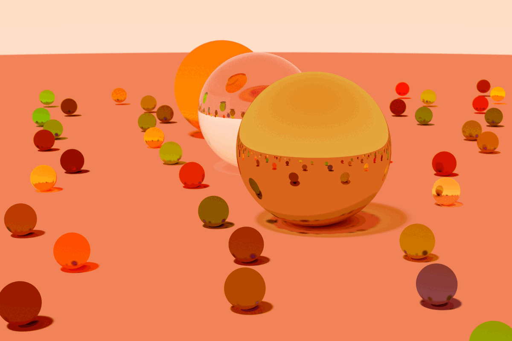

# ShingekiNoTracer
A RayTracer. 

Implements Basic Primitive Shapes, Transformations, Rotations, Reflection, Refraction, UV Texture Mapping.

Utilizes a BSP-tree hierarchy and CPU Multithreading. 

More renders in Renders/

---

This program requires the [stb image writing library](https://github.com/nothings/stb)

## References/Learning Material
---
[_learncpp.com_](https://www.learncpp.com/)

[_Ray Tracing in One Weekend_](https://raytracing.github.io/books/RayTracingInOneWeekend.html)

[_Ray Tracing: The Next Week_](https://raytracing.github.io/books/RayTracingTheNextWeek.html)

CS3388 - Computer Graphics at Western University

## 
